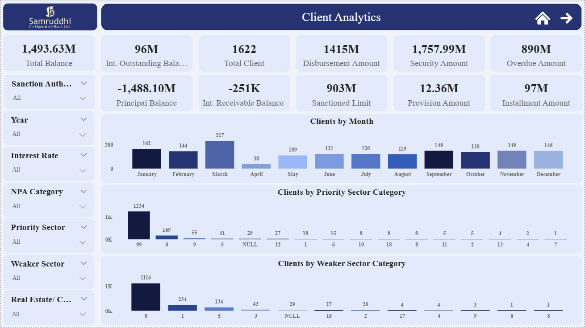

# **Banking Analytics Dashboard (Loan and Deposit Analysis Using Power BI)**

## **Project Overview**

This project presents a Banking Analytics Dashboard developed using Power BI to analyze loan and deposit data. The dashboard helps monitor key financial metrics such as loan exposure, outstanding balances, deposit distribution, and customer risk indicators.

The analysis provides insights into branch performance, loan portfolio structure, deposit trends, and potential risk areas. By transforming raw banking data into interactive visualizations, the dashboard enables better understanding of financial performance and supports data-driven decision making.

## **Dashboard Preview**

## **Dataset Information**

The project uses banking data related to loan accounts and term deposit accounts.

**1. Loan Dataset**  
File: Samruddhi bank_31032023 (loan dump).xlsx  
This dataset contains detailed loan account information including branch details, loan limits, outstanding balances, interest rates, installment details, security information, and NPA classification. All data from the single sheet in this file was used for analysis.

**2. Deposit Dataset**  
File: Deposite Dump 20231115.xlsx  
This dataset contains term deposit account information such as branch details, deposit balances, interest rates, deposit tenure, maturity dates, customer risk rating, and KYC status. Only the sheet named **“TD DUMP”** was used for the analysis.

## **Tools & Technologies Used**

- Power BI
- Power Query Editor (Data Cleaning & Transformation)
- DAX (Calculated Measures & KPIs)
- Microsoft Excel (Data Source)

## **Key Insights**

- Branch-wise analysis highlights the distribution of loan exposure and deposit balances across different branches.

- Identification of loan accounts with high outstanding balances and monitoring of overdue installments to detect potential risk areas.

- Analysis of NPA (Non-Performing Asset) accounts and their classification to understand the bank’s credit risk.

- Comparison of sanctioned loan limits with outstanding balances to evaluate credit utilization.

- Deposit portfolio analysis showing balance distribution, interest rate patterns, and maturity timelines.

- Identification of customer risk ratings and KYC status to understand compliance and risk profiles.

